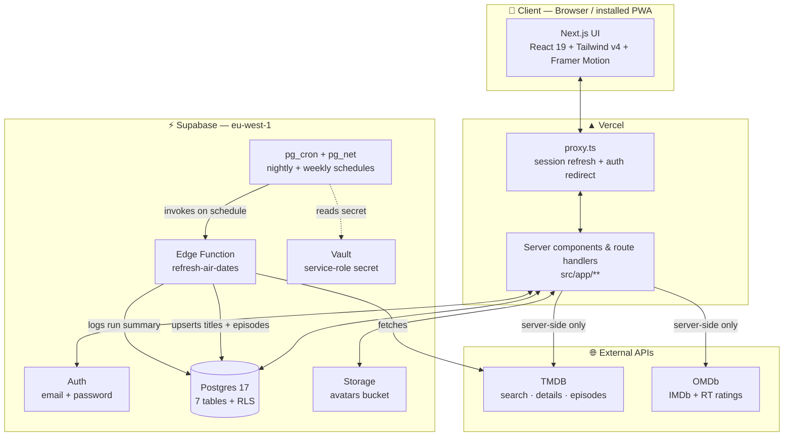
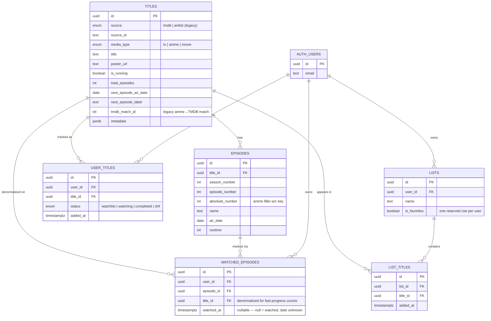
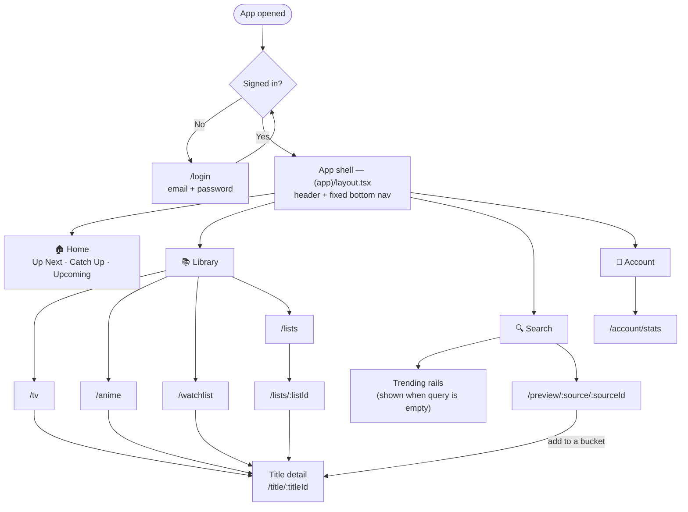
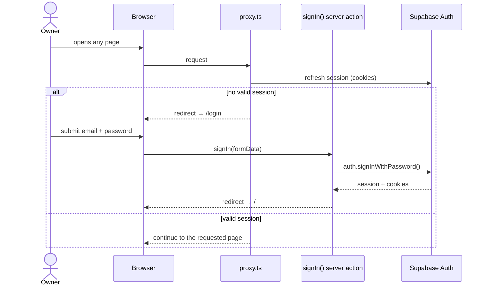
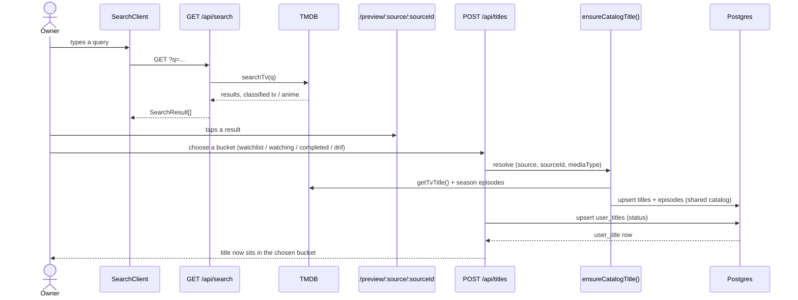
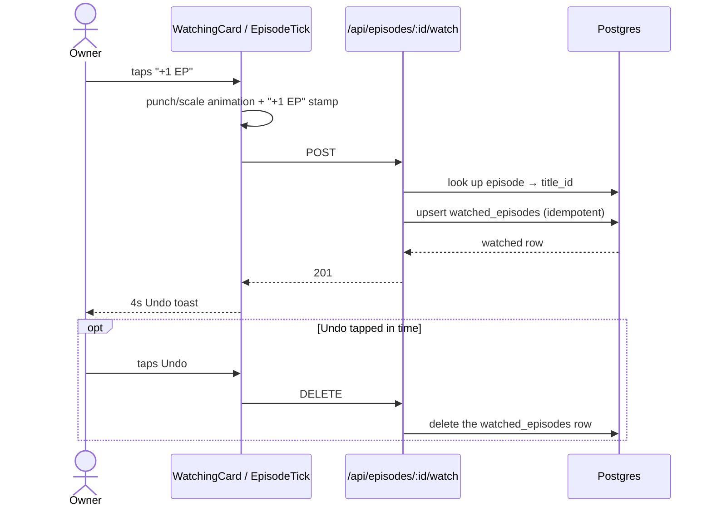
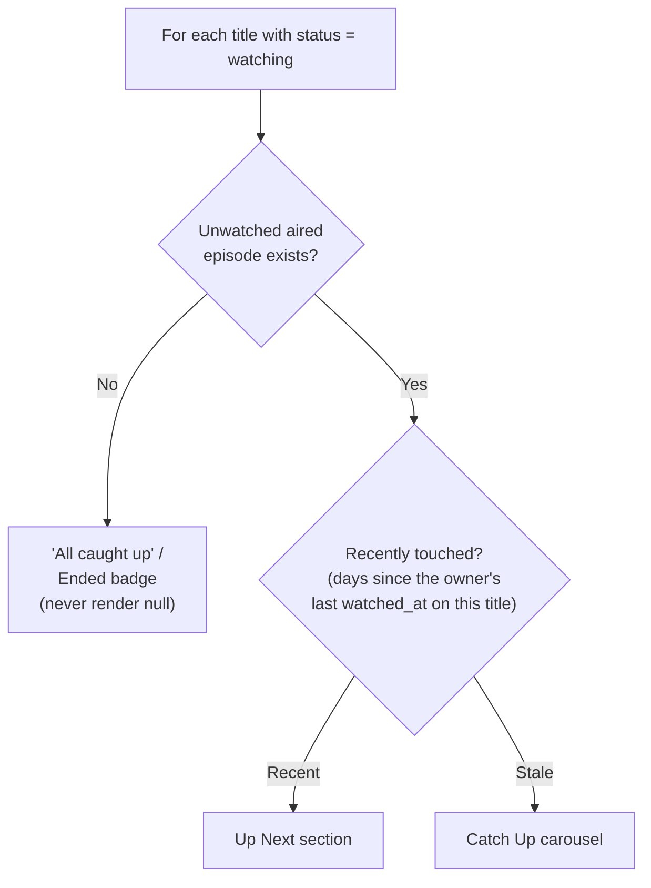
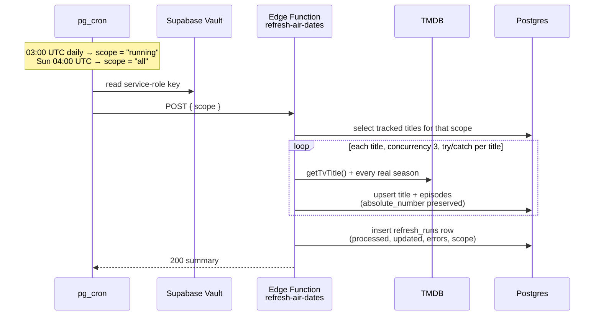

# TV Tracker

<p align="center">
  <a href="https://nextjs.org"></a>
  <a href="https://react.dev"></a>
  <a href="https://www.typescriptlang.org"></a>
  <a href="https://tailwindcss.com"></a>
  <a href="https://www.framer.com/motion/"></a>
  <a href="https://supabase.com"></a>
  <a href="https://vitest.dev"></a>
  <a href="https://vercel.com"></a>
</p>

A personal, mobile-first PWA for tracking TV shows and anime — what's being watched, a watchlist, completed, and dropped (DNF) — with per-episode one-tap "mark watched" and next-episode air dates. Built to replace TV Time (shut down) and Showly (disliked UI) with something fast, reliable, and opinionated about design.

Single user, single owner, no multi-tenant ambitions. Movies are deferred but the schema reserves room for them.

---

## Table of contents

- [How it's built](#how-its-built)
- [Architecture](#architecture)
- [Data model](#data-model)
- [Security (Row Level Security)](#security-row-level-security)
- [App surfaces & navigation](#app-surfaces--navigation)
- [User flows](#user-flows)
  - [Sign in](#1-sign-in)
  - [Search → add a title](#2-search--add-a-title)
  - [One-tap mark watched](#3-one-tap-mark-watched)
  - [Home screen: Up Next vs. Catch Up](#4-home-screen-up-next-vs-catch-up)
  - [Nightly / weekly catalog refresh](#5-nightly--weekly-catalog-refresh)
- [Project structure](#project-structure)
- [Getting started](#getting-started)
- [Testing](#testing)
- [Deployment](#deployment)

---

## How it's built

| Layer | Choice |
|---|---|
| Framework | [Next.js 16](https://nextjs.org) (App Router, `src/` dir), React 19, TypeScript |
| Styling | Tailwind CSS v4 (CSS-first `@theme` config in `globals.css`) |
| Motion | Framer Motion (mark-watched micro-interaction) |
| Backend | [Supabase](https://supabase.com) — Postgres 17, Auth, Row Level Security, Storage, Edge Functions, `pg_cron` |
| External data | [TMDB](https://www.themoviedb.org/documentation/api) for TV **and** anime search/details/episodes · [OMDb](https://www.omdbapi.com) for IMDb/Rotten Tomatoes ratings (fetched live, not stored) |
| Testing | Vitest (`tests/**/*.test.ts`) |
| Hosting | Vercel |

There is **no separate backend service**. "Backend" is Supabase (Postgres + Auth + RLS + scheduled jobs) plus a thin layer of Next.js server components and route handlers — Postgres and RLS do the heavy lifting rather than a custom API tier.

---

## Architecture



Provider calls (TMDB, OMDb) only ever happen server-side — route handlers and server components — never from the browser, so no third-party key is ever shipped to the client.

---

## Data model

Two shared **catalog** tables plus four per-user **tracking/organization** tables, keyed off Supabase Auth's `auth.users`:



A seventh table, **`refresh_runs`**, is an operational audit log (not part of the domain graph above) written by the nightly/weekly catalog refresh:

```
refresh_runs
├── started_at / finished_at
├── scope            'running' | 'all'
├── processed / updated / episodes_upserted
├── error_count / errors (jsonb)
```

The Account tab reads its latest row per scope to show a **"Last refreshed"** tag, surfacing the error count rather than a bare timestamp that would look healthy even if a run partially failed.

**Notes on the model:**
- `titles` is a shared catalog, unique on `(source, source_id)` — every user (in practice, the one owner today) sees the same row for the same show.
- Anime is **fully TMDB-sourced** with real season/episode coordinates (`media_type = 'anime'` is a label, not a different data source). `absolute_number` is still computed and stored on every anime episode because filler-arc tagging (`animefillerlist.ts`) keys off it.
- `watched_episodes.watched_at` is nullable on purpose: a retrospective "mark this whole show completed" can't fabricate a real watch date. New per-episode/per-season marks default to `now()`.
- An `updated_at` trigger (`set_updated_at`, hardened `search_path`) maintains timestamps across the tracking tables.

---

## Security (Row Level Security)

RLS is enabled on all seven tables:

| Table(s) | Policy |
|---|---|
| `titles`, `episodes` (catalog) | Any authenticated user can `select`, **and** `insert`/`update` — since this is a single-user app with no service-role secret on the web server, adding a show from search has to be able to write the shared catalog. (First thing to lock down behind a service role if this ever goes multi-user.) |
| `user_titles`, `watched_episodes`, `lists` | Owner-only, gated by `user_id = auth.uid()` (defaulted on insert). |
| `list_titles` | No `user_id` of its own — ownership is checked by joining up to the parent `lists` row. |
| `refresh_runs` | `select`-only for authenticated users; only the Edge Function (service-role key) writes rows. |
| `avatars` Storage bucket | Public-read (so avatar URLs render without signing), authenticated-only insert/update/delete. |

---

## App surfaces & navigation

A bottom-tab PWA shell with four icon tabs:



- **Home** — currently-watching cards split into *Up Next* / *Catch Up*, an *Upcoming* section, one-tap mark-watched.
- **Library** — a route group (`(library)`) over `/tv`, `/anime`, `/watchlist`, `/lists`; poster-cover grids split into the four status buckets, DNF muted, switched via a segmented sub-nav.
- **Search** — queries TMDB for TV and anime; two "explore" trending rails (TV / anime) fill the screen before anything is typed.
- **Account** — profile, avatar, sign out, last-refreshed status, and `/account/stats`.

---

## User flows

### 1. Sign in

Single user, email + password via Supabase Auth. `src/proxy.ts` (Next 16's renamed middleware) refreshes the session on every request and redirects unauthenticated requests to `/login`.



### 2. Search → add a title



`ensureCatalogTitle` upserts the shared `titles`/`episodes` rows only if the title isn't already known — every user of the catalog (today, just the one owner) reuses the same rows.

### 3. One-tap mark watched



Both directions are idempotent: marking an already-watched episode, or unmarking one that isn't, just succeeds instead of erroring.

### 4. Home screen: Up Next vs. Catch Up



Deliberately keyed on the owner's **own watch activity** (`watched_episodes.watched_at`), not episode air date — an air-date rule would strand a show the owner simply hasn't gotten to in Catch Up forever, even after they marked something else on it yesterday.

### 5. Nightly / weekly catalog refresh

The only background automation in the app: a Supabase Edge Function keeps air dates and episode lists current without the owner ever opening the app.



Two scopes, two schedules:

| Scope | Schedule | Sweeps |
|---|---|---|
| `running` | Nightly, 03:00 UTC | Only `titles.is_running = true` — the cheap, frequent pass |
| `all` | Weekly, Sunday 04:00 UTC | Every title the owner tracks, any status — keeps `is_running` itself honest |

The service-role key is read from Supabase **Vault** at execution time, so no secret is ever committed to a migration file.

---

## Project structure

```
src/
├── app/
│   ├── (app)/                     # authed shell — header + bottom nav
│   │   ├── (library)/             # /tv, /anime, /watchlist, /lists
│   │   ├── account/               # profile + /account/stats
│   │   ├── preview/[source]/[sourceId]/
│   │   ├── search/
│   │   ├── title/[titleId]/
│   │   └── page.tsx               # Home
│   ├── api/                       # route handlers (search, titles, episodes,
│   │                              #  lists, favorites, account, refresh)
│   ├── auth/confirm/               # email-confirm callback
│   └── login/                     # outside the authed shell
├── components/                    # cards, grids, action sheets, stats widgets
├── lib/
│   ├── tmdb.ts                    # TV + anime search/details (TMDB)
│   ├── tmdbAnimeMatch.ts          # AniList→TMDB match helpers (legacy anime rows)
│   ├── animefillerlist.ts         # filler-episode tagging, keyed on absolute_number
│   ├── ratings.ts                 # IMDb / RT via OMDb (fetched live, not stored)
│   ├── favorites.ts, stats.ts, useTitleActions.ts
│   ├── supabase/{client,server,middleware}.ts
│   ├── api/                       # server-side helpers behind the route handlers
│   └── types.ts                   # NormalizedTitle / NormalizedEpisode
├── proxy.ts                        # Next 16 middleware — session refresh + auth gate
supabase/
├── functions/refresh-air-dates/   # the nightly/weekly Edge Function
└── migrations/                    # applied schema history
tests/                              # vitest — tests/**/*.test.ts
```

---

## Getting started

```bash
npm install
cp .env.example .env.local   # then fill in the Supabase + TMDB values
npm run dev                  # http://localhost:3000
```

Environment variables:

| Var | Where | Notes |
|---|---|---|
| `TMDB_API_KEY` | `.env` | TMDB v4 Read Access Token, server-only |
| `OMDB_API_KEY` | `.env` | powers IMDb/Rotten Tomatoes ratings on the title detail screen |
| `NEXT_PUBLIC_SUPABASE_URL` | `.env.local` | safe to expose to the browser |
| `NEXT_PUBLIC_SUPABASE_ANON_KEY` | `.env.local` | the publishable key, safe to expose |

Edge Function secrets (`supabase secrets set …`) and the Vault-stored service-role key are **separate stores** from these `.env` files — see `supabase/functions/refresh-air-dates/README.md` for that side of the setup.

```bash
npm run build   # production build
npm run start   # serve the production build
npm run lint    # eslint
```

## Testing

```bash
npm test                                  # vitest run — full suite
npm run test:watch                        # watch mode
npx vitest run tests/lib/tmdb.test.ts     # single file
npx vitest run -t "name fragment"         # single test by name
```

## Deployment

Deployed to **Vercel**. Database migrations are applied to the Supabase project (`ermhfiofisjsrniccqlv`, eu-west-1) via the Supabase MCP tools / CLI, with local copies kept under `supabase/migrations/`. After any schema change, run the Supabase security & performance advisors and address what they flag.
