# TV Tracker

<p align="center">
  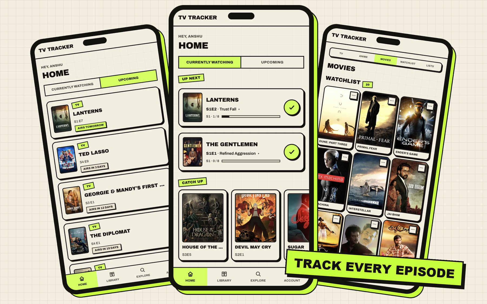
</p>

<p align="center">
  <a href="https://nextjs.org"></a>
  <a href="https://react.dev"></a>
  <a href="https://www.typescriptlang.org"></a>
  <a href="https://tailwindcss.com"></a>
  <a href="https://www.framer.com/motion/"></a>
  <a href="https://supabase.com"></a>
  <a href="https://vitest.dev"></a>
  <a href="https://vercel.com"></a>
</p>

TV Tracker keeps track of the TV shows, anime and movies you watch. It knows what you're in the middle of, what's on your watchlist, what you've finished and what you gave up on. Marking an episode watched takes one tap, and every show you follow tells you when its next episode airs.

I built it to replace TV Time, which shut down, and Showly, whose design I never got on with. It's a web app made for phones, and you can install it to your home screen.

## A tour of the app

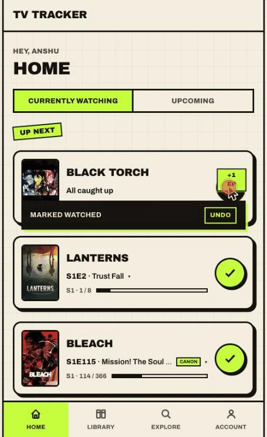

- **One tap per episode.** Tap the check next to a show and the next episode is marked watched. If you tapped the wrong one, the toast has an undo button.
- **Shows sort themselves.** Watch the last aired episode and the show moves to Completed. When a new season starts airing, it moves back to Watching.
- **Movies sit alongside shows.** Rate them, keep a watchlist and mark them watched from the same library.
- **Filler tags for anime.** Long-running series like Naruto show whether each episode is canon, mixed or filler.

<br clear="right">

### Always know what's next

Home puts the next episode of every show you're watching at the top, along with how far through the season you are. Shows you haven't touched in a month move down to Catch up. The Upcoming tab lists air dates for everything you track.

<p align="center">
  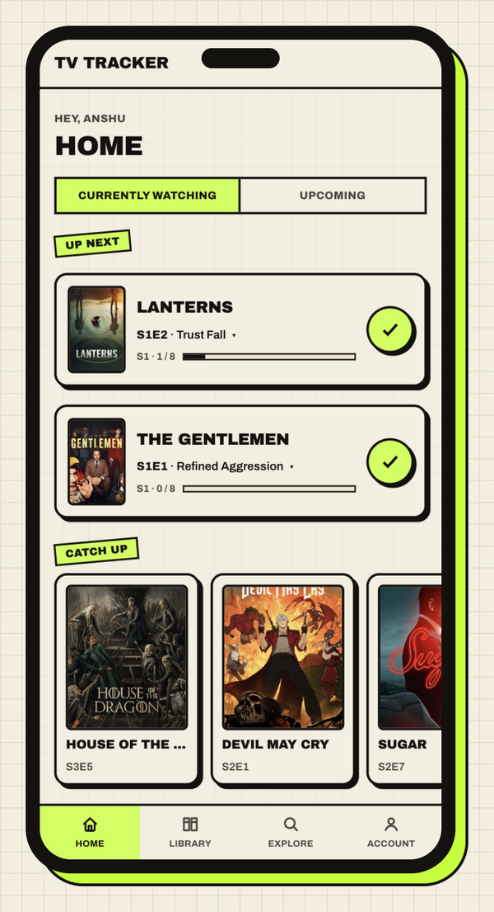
  &nbsp;&nbsp;
  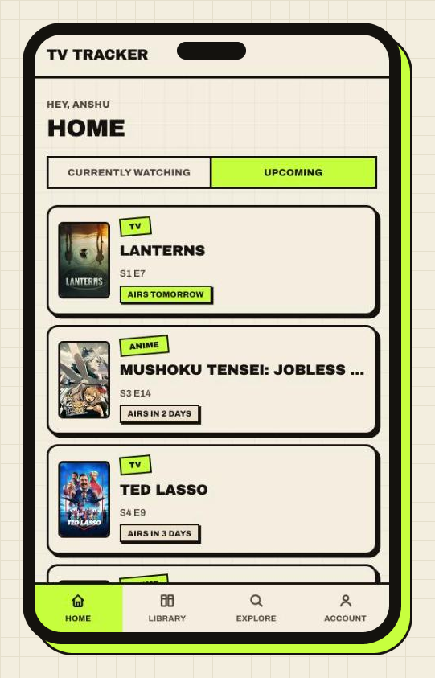
</p>

### Shows and movies

Every title has its own page with its status, your rating, favorites and IMDb and Rotten Tomatoes scores. Shows list their episodes season by season. Movies show their runtime, director and cast.

<p align="center">
  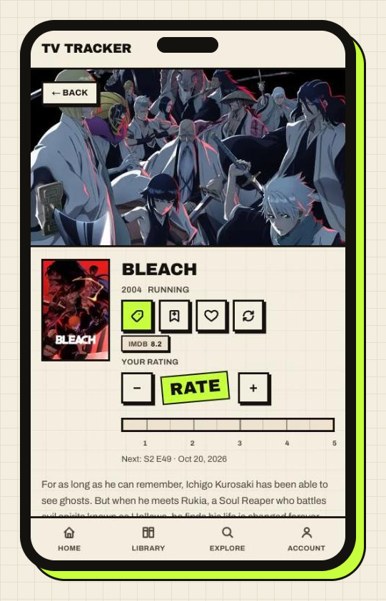
  &nbsp;&nbsp;
  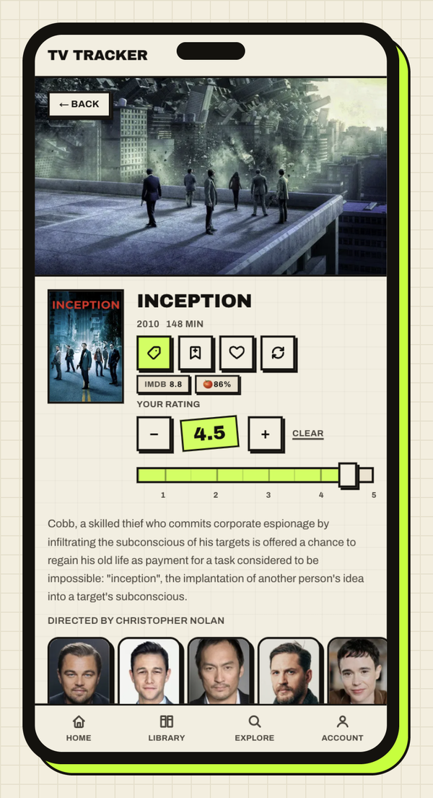
</p>

### Your library

The library has a tab each for TV, anime and movies, plus your watchlist and your own lists. Inside each tab, titles are grouped by status: watching, watchlist, completed and dropped.

<p align="center">
  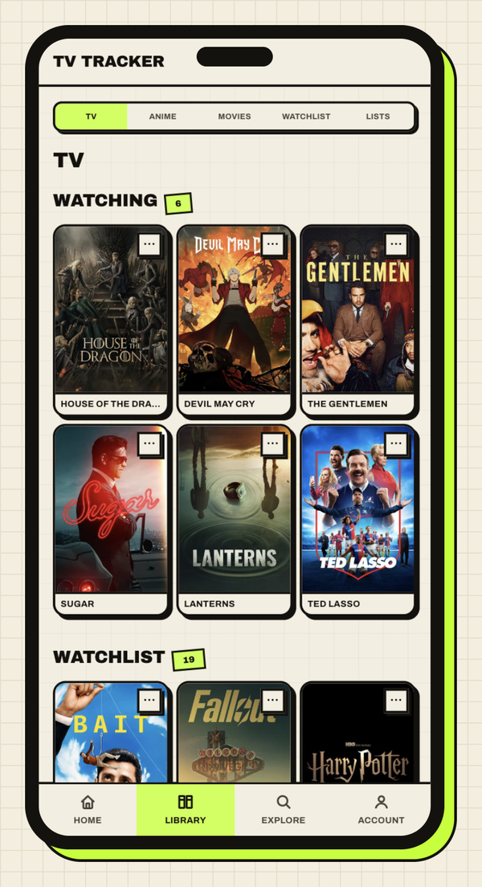
  &nbsp;&nbsp;
  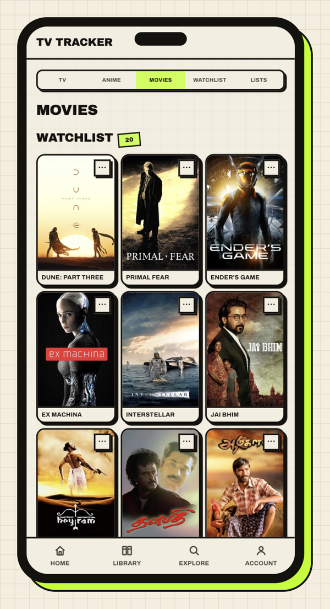
</p>

### Find something new, and look back

Explore searches TMDB for shows and movies. Before you type anything, it recommends titles based on what you've finished, with separate rows for TV, anime and movies. Stats adds up the episodes and hours you've watched and ranks your shows by time spent.

<p align="center">
  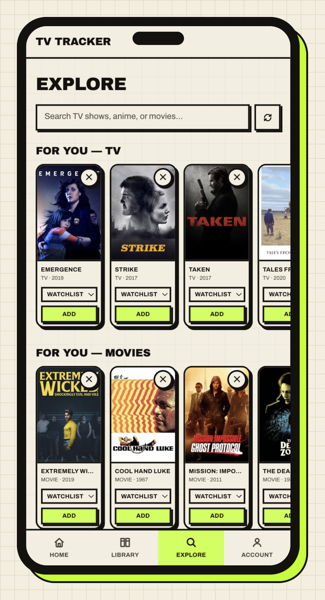
  &nbsp;&nbsp;
  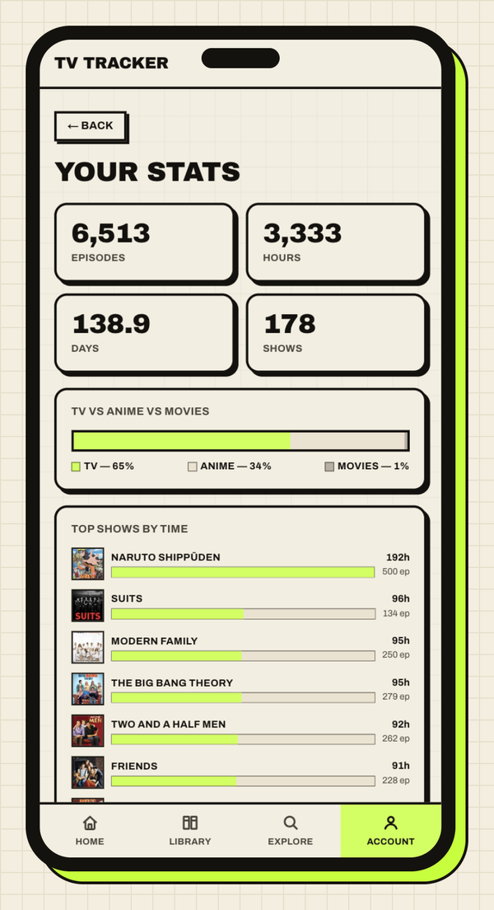
</p>

---

## Table of contents

- [A tour of the app](#a-tour-of-the-app)
- [How it's built](#how-its-built)
- [Architecture](#architecture)
- [Data model](#data-model)
- [Security (Row Level Security)](#security-row-level-security)
- [App surfaces and navigation](#app-surfaces-and-navigation)
- [User flows](#user-flows)
  - [Sign in](#1-sign-in)
  - [Search and add a title](#2-search-and-add-a-title)
  - [Mark an episode watched](#3-mark-an-episode-watched)
  - [Home screen: Up next vs. Catch up](#4-home-screen-up-next-vs-catch-up)
  - [Nightly and weekly catalog refresh](#5-nightly-and-weekly-catalog-refresh)
- [Project structure](#project-structure)
- [Getting started](#getting-started)
- [Testing](#testing)
- [Deployment](#deployment)

---

## How it's built

| Layer | Choice |
|---|---|
| Framework | [Next.js 16](https://nextjs.org) (App Router, `src/` dir), React 19, TypeScript |
| Styling | Tailwind CSS v4, configured in CSS with `@theme` in `globals.css` |
| Motion | Framer Motion, for the mark-watched animation |
| Backend | [Supabase](https://supabase.com): Postgres 17, Auth, Row Level Security, Storage, Edge Functions, `pg_cron` |
| External data | [TMDB](https://www.themoviedb.org/documentation/api) for TV, anime and movie search, details and episodes. [OMDb](https://www.omdbapi.com) for IMDb and Rotten Tomatoes ratings, fetched live and not stored |
| Testing | Vitest (`tests/**/*.test.ts`) |
| Hosting | Vercel |

There is no separate backend service. Supabase handles the database, auth, row-level security and scheduled jobs, and a small set of Next.js server components and route handlers sits on top. Postgres and RLS do most of the work, so there's no custom API tier to maintain.

---

## Architecture

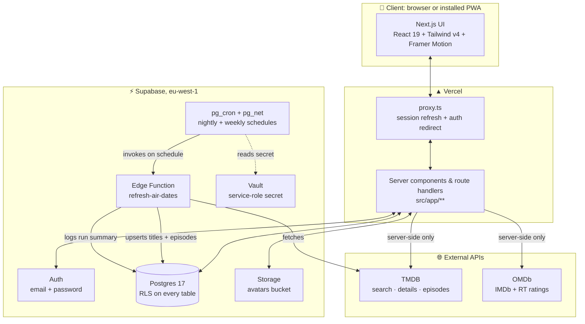
```mermaid
graph TB
    subgraph Client["📱 Client: browser or installed PWA"]
        UI["Next.js UI<br/>React 19 + Tailwind v4 + Framer Motion"]
    end

    subgraph Vercel["▲ Vercel"]
        Proxy["proxy.ts<br/>session refresh + auth redirect"]
        RSC["Server components & route handlers<br/>src/app/**"]
    end

    subgraph Supabase["⚡ Supabase, eu-west-1"]
        Auth["Auth<br/>email + password"]
        DB[("Postgres 17<br/>RLS on every table")]
        Storage["Storage<br/>avatars bucket"]
        Edge["Edge Function<br/>refresh-air-dates"]
        Cron["pg_cron + pg_net<br/>nightly + weekly schedules"]
        Vault["Vault<br/>service-role secret"]
    end

    subgraph External["🌐 External APIs"]
        TMDB["TMDB<br/>search · details · episodes"]
        OMDb["OMDb<br/>IMDb + RT ratings"]
    end

    UI <--> Proxy
    Proxy <--> RSC
    RSC -->|server-side only| TMDB
    RSC -->|server-side only| OMDb
    RSC <--> Auth
    RSC <--> DB
    RSC <--> Storage
    Cron -.->|reads secret| Vault
    Cron -->|invokes on schedule| Edge
    Edge -->|fetches| TMDB
    Edge -->|upserts titles + episodes| DB
    Edge -->|logs run summary| DB
```

TMDB and OMDb are only ever called from route handlers and server components, never from the browser, so their API keys never reach the client.

---

## Data model

Two shared catalog tables hold every show, anime and movie. Four per-account tables hold what each person tracks and has watched. All of them hang off Supabase Auth's `auth.users`.

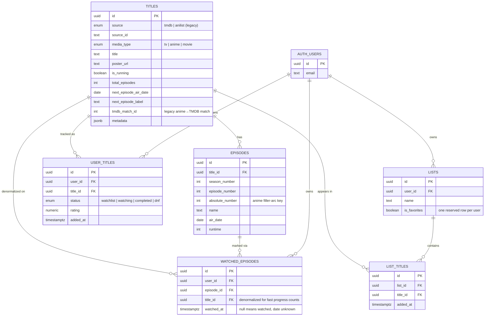
```mermaid
erDiagram
    TITLES ||--o{ EPISODES : "has"
    TITLES ||--o{ USER_TITLES : "tracked as"
    TITLES ||--o{ WATCHED_EPISODES : "denormalized on"
    TITLES ||--o{ LIST_TITLES : "appears in"
    EPISODES ||--o{ WATCHED_EPISODES : "marked via"
    LISTS ||--o{ LIST_TITLES : "contains"
    AUTH_USERS ||--o{ USER_TITLES : "owns"
    AUTH_USERS ||--o{ WATCHED_EPISODES : "owns"
    AUTH_USERS ||--o{ LISTS : "owns"

    TITLES {
        uuid id PK
        enum source "tmdb | anilist (legacy)"
        text source_id
        enum media_type "tv | anime | movie"
        text title
        text poster_url
        boolean is_running
        int total_episodes
        date next_episode_air_date
        text next_episode_label
        int tmdb_match_id "legacy anime→TMDB match"
        jsonb metadata
    }

    EPISODES {
        uuid id PK
        uuid title_id FK
        int season_number
        int episode_number
        int absolute_number "anime filler-arc key"
        text name
        date air_date
        int runtime
    }

    USER_TITLES {
        uuid id PK
        uuid user_id FK
        uuid title_id FK
        enum status "watchlist | watching | completed | dnf"
        numeric rating
        timestamptz added_at
    }

    WATCHED_EPISODES {
        uuid id PK
        uuid user_id FK
        uuid episode_id FK
        uuid title_id FK "denormalized for fast progress counts"
        timestamptz watched_at "null means watched, date unknown"
    }

    LISTS {
        uuid id PK
        uuid user_id FK
        text name
        boolean is_favorites "one reserved row per user"
    }

    LIST_TITLES {
        uuid id PK
        uuid list_id FK
        uuid title_id FK
        timestamptz added_at
    }

    AUTH_USERS {
        uuid id PK
        text email
    }
```

Three more tables sit outside that graph. `recommendations` and `rec_dismissals` store each account's Explore suggestions and the ones it has dismissed. `refresh_runs` is an audit log written by the catalog refresh:

```
refresh_runs
├── started_at / finished_at
├── scope            'running' | 'all'
├── processed / updated / episodes_upserted
├── error_count / errors (jsonb)
```

The Account tab reads the latest row for each scope and shows a "Last refreshed" tag. It includes the error count, because a bare timestamp would look healthy even after a run that partly failed.

Notes on the model:

- `titles` is a shared catalog, unique on `(source, source_id)`. Two accounts tracking the same show share one row and one nightly refresh.
- A movie is a title with a single episode row that has no season or episode number. That row lets movies reuse the same watched, progress and stats code as shows.
- Anime comes from TMDB like everything else, with real season and episode numbers. `media_type = 'anime'` is a label, not a separate data source. Anime episodes also store an `absolute_number`, because filler tagging (`animefillerlist.ts`) looks episodes up by it.
- `watched_episodes.watched_at` can be null. Marking a whole show completed after the fact shouldn't invent watch dates, so those marks have none. Marks made one episode or one season at a time get the current time.
- An `updated_at` trigger (`set_updated_at`, with a locked-down `search_path`) keeps timestamps current on the tracking tables.

---

## Security (Row Level Security)

RLS is on for every table:

| Table(s) | Policy |
|---|---|
| `titles`, `episodes` (catalog) | Any signed-in account can read, insert and update. The web server has no service-role key, so adding a title from search has to write the catalog directly. The tradeoff is that any account can overwrite catalog metadata. Move these writes behind a service role before letting in accounts you don't trust. |
| `user_titles`, `watched_episodes`, `lists`, `recommendations`, `rec_dismissals` | Each account sees only its own rows, gated by `user_id = auth.uid()`, which is also the default on insert. |
| `list_titles` | Has no `user_id` of its own. Ownership is checked through the parent `lists` row. |
| `refresh_runs` | Signed-in accounts can read it. Only the Edge Function, using the service-role key, writes to it. |
| `avatars` Storage bucket | Anyone can read, so avatar URLs work without signing. Only signed-in accounts can upload, update or delete. |

---

## App surfaces and navigation

The app has a fixed bottom bar with four tabs:

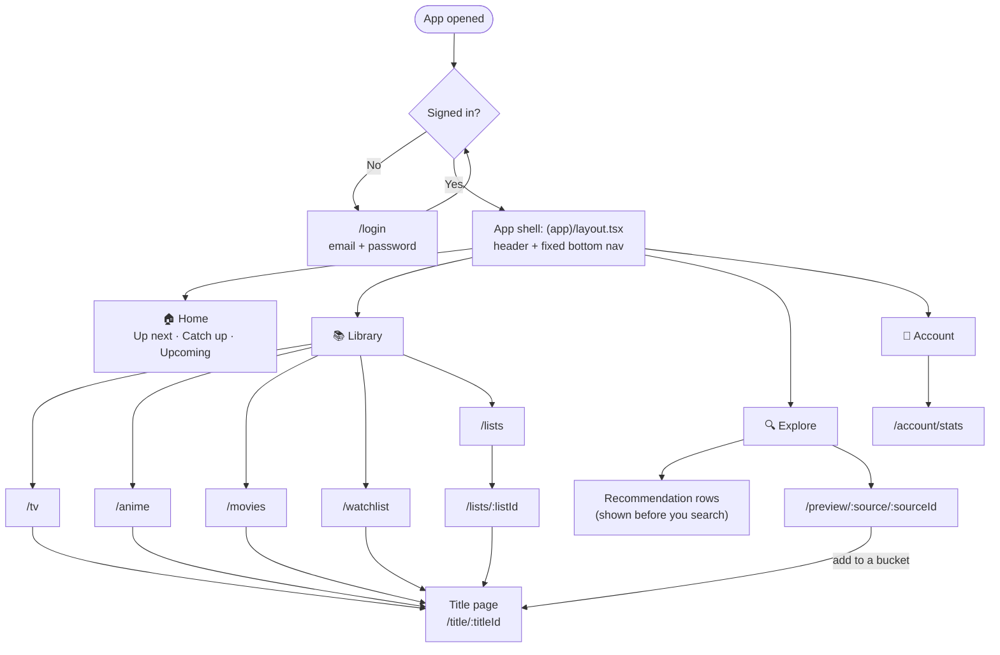
```mermaid
flowchart TD
    Start(["App opened"]) --> Check{"Signed in?"}
    Check -- No --> Login["/login<br/>email + password"]
    Login --> Check
    Check -- Yes --> Shell["App shell: (app)/layout.tsx<br/>header + fixed bottom nav"]

    Shell --> Home["🏠 Home<br/>Up next · Catch up · Upcoming"]
    Shell --> Library["📚 Library"]
    Shell --> Explore["🔍 Explore"]
    Shell --> Account["👤 Account"]

    Library --> TV["/tv"]
    Library --> Anime["/anime"]
    Library --> Movies["/movies"]
    Library --> Watchlist["/watchlist"]
    Library --> Lists["/lists"]

    TV --> TitlePage["Title page<br/>/title/:titleId"]
    Anime --> TitlePage
    Movies --> TitlePage
    Watchlist --> TitlePage
    Lists --> ListDetail["/lists/:listId"] --> TitlePage

    Explore --> Recs["Recommendation rows<br/>(shown before you search)"]
    Explore --> Preview["/preview/:source/:sourceId"]
    Preview -->|add to a bucket| TitlePage

    Account --> Stats["/account/stats"]
```

- **Home** shows the shows you're watching, split into Up next and Catch up, plus an Upcoming tab and the one-tap watched button.
- **Library** is a route group (`(library)`) over `/tv`, `/anime`, `/movies`, `/watchlist` and `/lists`. Each page is a poster grid grouped by status, with dropped titles faded out.
- **Explore** searches TMDB for TV, anime and movies. Before you type, it shows recommendations based on what you've finished.
- **Account** has your profile, avatar, sign out, the last-refreshed status and `/account/stats`.

---

## User flows

### 1. Sign in

Each person has their own account, with email and password through Supabase Auth. `src/proxy.ts` (Next 16's name for middleware) refreshes the session on every request and sends signed-out requests to `/login`.

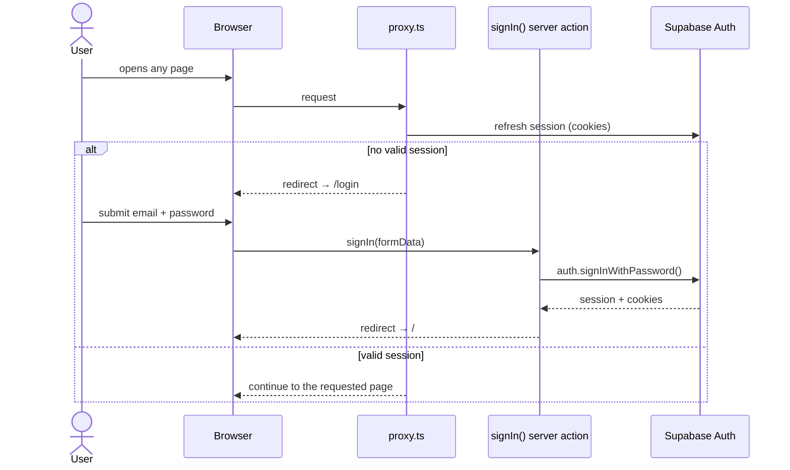
```mermaid
sequenceDiagram
    actor U as User
    participant B as Browser
    participant P as proxy.ts
    participant A as signIn() server action
    participant S as Supabase Auth

    U->>B: opens any page
    B->>P: request
    P->>S: refresh session (cookies)
    alt no valid session
        P-->>B: redirect → /login
        U->>B: submit email + password
        B->>A: signIn(formData)
        A->>S: auth.signInWithPassword()
        S-->>A: session + cookies
        A-->>B: redirect → /
    else valid session
        P-->>B: continue to the requested page
    end
```

### 2. Search and add a title

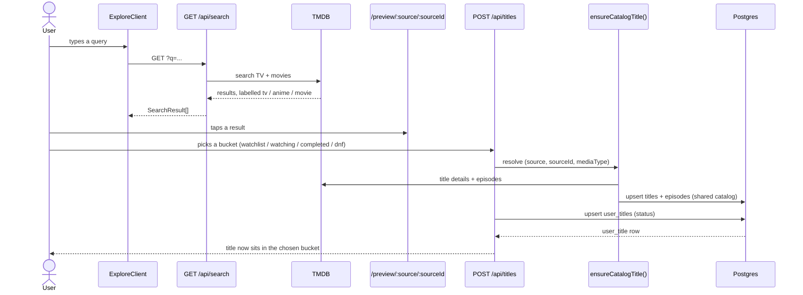
```mermaid
sequenceDiagram
    actor U as User
    participant UI as ExploreClient
    participant API as GET /api/search
    participant TMDB
    participant Preview as /preview/:source/:sourceId
    participant Add as POST /api/titles
    participant Cat as ensureCatalogTitle()
    participant DB as Postgres

    U->>UI: types a query
    UI->>API: GET ?q=...
    API->>TMDB: search TV + movies
    TMDB-->>API: results, labelled tv / anime / movie
    API-->>UI: SearchResult[]
    U->>Preview: taps a result
    U->>Add: picks a bucket (watchlist / watching / completed / dnf)
    Add->>Cat: resolve (source, sourceId, mediaType)
    Cat->>TMDB: title details + episodes
    Cat->>DB: upsert titles + episodes (shared catalog)
    Add->>DB: upsert user_titles (status)
    DB-->>Add: user_title row
    Add-->>U: title now sits in the chosen bucket
```

`ensureCatalogTitle` only writes the `titles` and `episodes` rows if the title isn't in the catalog yet. Everyone who adds the same title shares those rows.

### 3. Mark an episode watched

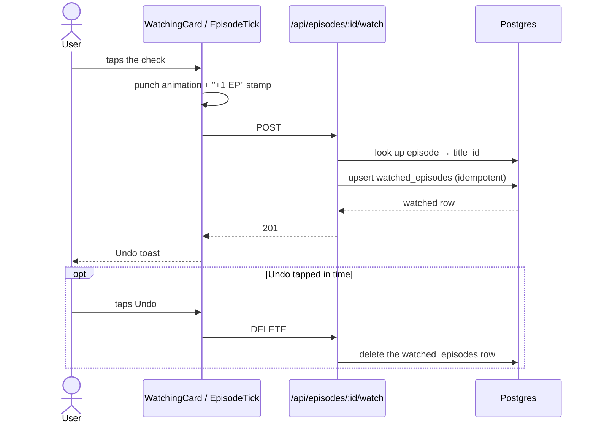
```mermaid
sequenceDiagram
    actor U as User
    participant Card as WatchingCard / EpisodeTick
    participant API as /api/episodes/:id/watch
    participant DB as Postgres

    U->>Card: taps the check
    Card->>Card: punch animation + "+1 EP" stamp
    Card->>API: POST
    API->>DB: look up episode → title_id
    API->>DB: upsert watched_episodes (idempotent)
    DB-->>API: watched row
    API-->>Card: 201
    Card-->>U: Undo toast
    opt Undo tapped in time
        U->>Card: taps Undo
        Card->>API: DELETE
        API->>DB: delete the watched_episodes row
    end
```

Both calls are idempotent. Marking an episode that's already watched, or unmarking one that isn't, succeeds without an error.

### 4. Home screen: Up next vs. Catch up

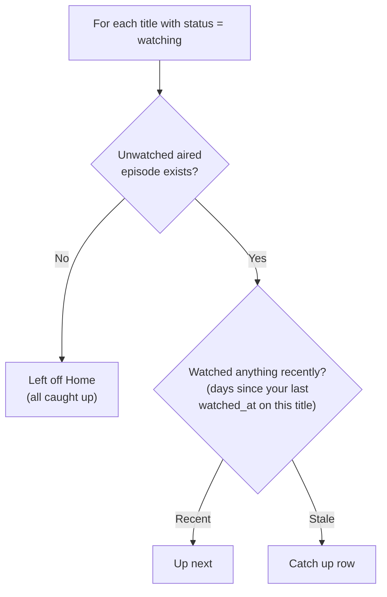
```mermaid
flowchart TD
    A["For each title with status = watching"] --> B{"Unwatched aired<br/>episode exists?"}
    B -- No --> C["Left off Home<br/>(all caught up)"]
    B -- Yes --> D{"Watched anything recently?<br/>(days since your last<br/>watched_at on this title)"}
    D -- Recent --> E["Up next"]
    D -- Stale --> F["Catch up row"]
```

The split uses when you last watched something, not when episodes aired. Going by air dates would leave a show you're slowly getting through stuck in Catch up, even if you watched an episode of it yesterday.

### 5. Nightly and weekly catalog refresh

A Supabase Edge Function keeps air dates and episode lists up to date without anyone opening the app. For anime, the same run also updates the canon and filler tags.

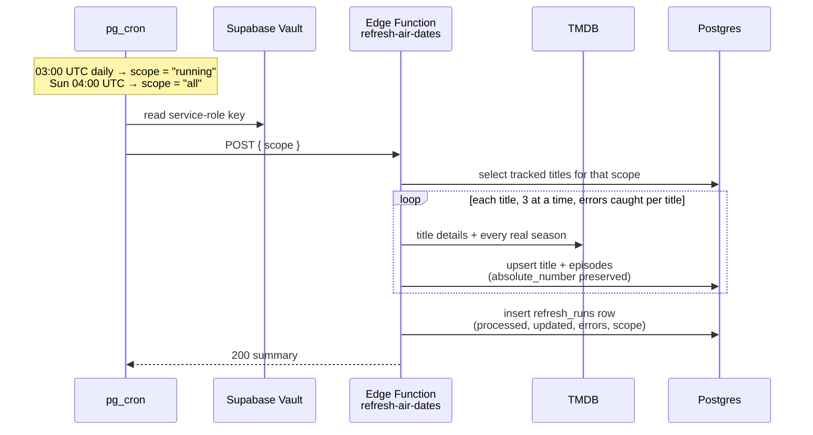
```mermaid
sequenceDiagram
    participant Cron as pg_cron
    participant Vault as Supabase Vault
    participant Edge as Edge Function<br/>refresh-air-dates
    participant TMDB
    participant DB as Postgres

    Note over Cron: 03:00 UTC daily → scope = "running"<br/>Sun 04:00 UTC → scope = "all"
    Cron->>Vault: read service-role key
    Cron->>Edge: POST { scope }
    Edge->>DB: select tracked titles for that scope
    loop each title, 3 at a time, errors caught per title
        Edge->>TMDB: title details + every real season
        Edge->>DB: upsert title + episodes<br/>(absolute_number preserved)
    end
    Edge->>DB: insert refresh_runs row<br/>(processed, updated, errors, scope)
    Edge-->>Cron: 200 summary
```

| Scope | Schedule | Covers |
|---|---|---|
| `running` | Nightly, 03:00 UTC | Only titles with `is_running = true`. Cheap enough to run every night. |
| `all` | Weekly, Sunday 04:00 UTC | Every tracked title, whatever its status. This is what catches a show that has quietly come back. |

The cron job reads the service-role key from Supabase Vault when it runs, so no secret is ever committed in a migration.

---

## Project structure

```
src/
├── app/
│   ├── (app)/                     # signed-in shell: header + bottom nav
│   │   ├── (library)/             # /tv, /anime, /movies, /watchlist, /lists
│   │   ├── account/               # profile + /account/stats
│   │   ├── explore/               # search + recommendations
│   │   ├── preview/[source]/[sourceId]/
│   │   ├── title/[titleId]/
│   │   └── page.tsx               # Home
│   ├── api/                       # route handlers (search, titles, episodes,
│   │                              #  lists, favorites, recommendations, account)
│   ├── auth/confirm/              # email-confirm callback
│   └── login/                     # outside the signed-in shell
├── components/                    # cards, grids, action sheets, stats widgets
├── lib/
│   ├── tmdb.ts                    # TV, anime and movie search/details (TMDB)
│   ├── tmdbAnimeMatch.ts          # AniList→TMDB match helpers (legacy anime rows)
│   ├── animefillerlist.ts         # filler tagging, keyed on absolute_number
│   ├── ratings.ts                 # IMDb / RT via OMDb (fetched live, not stored)
│   ├── favorites.ts, stats.ts, useTitleActions.ts
│   ├── supabase/{client,server,middleware}.ts
│   ├── api/                       # server-side helpers behind the route handlers
│   └── types.ts                   # NormalizedTitle / NormalizedEpisode
├── proxy.ts                       # Next 16 middleware: session refresh + auth gate
supabase/
├── functions/refresh-air-dates/   # the nightly/weekly Edge Function
└── migrations/                    # applied schema history
tests/                             # vitest: tests/**/*.test.ts
```

---

## Getting started

```bash
npm install
cp .env.example .env.local   # then fill in the Supabase + TMDB values
npm run dev                  # http://localhost:3000
```

Environment variables:

| Var | Where | Notes |
|---|---|---|
| `TMDB_API_KEY` | `.env` | TMDB v4 read access token, server-only |
| `OMDB_API_KEY` | `.env` | IMDb and Rotten Tomatoes ratings on title pages |
| `NEXT_PUBLIC_SUPABASE_URL` | `.env.local` | safe to expose to the browser |
| `NEXT_PUBLIC_SUPABASE_ANON_KEY` | `.env.local` | the publishable key, safe to expose |

The Edge Function's secrets (`supabase secrets set …`) and the service-role key in Vault are stored separately from these `.env` files. `supabase/functions/refresh-air-dates/README.md` covers that setup.

```bash
npm run build   # production build
npm run start   # serve the production build
npm run lint    # eslint
```

## Testing

```bash
npm test                                  # vitest run, full suite
npm run test:watch                        # watch mode
npx vitest run tests/lib/tmdb.test.ts     # single file
npx vitest run -t "name fragment"         # single test by name
```

## Deployment

The app runs on Vercel. Database migrations are applied to the Supabase project (`ermhfiofisjsrniccqlv`, eu-west-1) through the Supabase MCP tools or CLI, with a copy of each kept under `supabase/migrations/`. After any schema change, run the Supabase security and performance advisors and fix what they flag.
